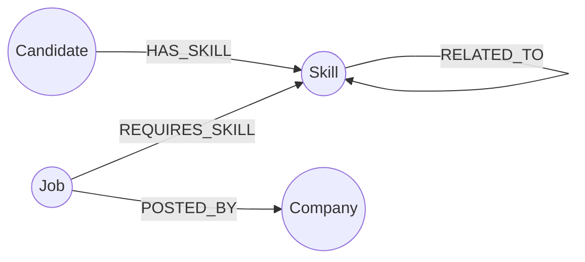

# SkillGraph

A job-and-skills matching app backed by [CognoDB](https://console.cognodb.com), a managed graph
database that speaks openCypher over Bolt. SkillGraph models candidates, skills, jobs and
companies as one connected graph, so questions about *who fits what, and why* are single
traversals instead of piles of joins.

Built for the Wexa AI take-home assignment.

- **Demo:** `<add your hosted URL here>`
- **Screen recording:** `<add your recording link here>`
- **Repo:** `<add your GitHub URL here>`

---

## 1. The use case

Recruiters and job seekers both ask the same underlying question over and over: *given what I
have, what am I close to?* A candidate wants to know which jobs they nearly qualify for and
exactly what's missing. A recruiter wants to know which candidates are worth a skills
conversation even if they're not a perfect match today. Neither question is well served by a
flat list of postings or a keyword search — they're both about **distance through a network of
skills**.

SkillGraph is a small app that answers those questions directly:

- For a **candidate**, it ranks every open job by how many required skills they already have,
  and lists exactly which ones they're missing.
- For a **job**, it ranks every candidate the same way, surfacing near-misses worth an
  upskilling conversation, not just perfect matches.
- It finds **similar candidates** (people who share your skills) and **similar companies**
  (companies hiring for the same skill set as a given company).
- It traces the **shortest path between any two skills** through a skill-adjacency graph built
  from what tends to appear together on real postings (e.g. Docker → Kubernetes → AWS → Java).

### Why a graph database?

Every one of those features is a *traversal of relationships*, not a lookup of rows:

- **Multi-hop matching** — `(Candidate)-[:HAS_SKILL]->(Skill)<-[:REQUIRES_SKILL]-(Job)` is a
  single two-hop pattern in Cypher. In a relational schema this is a join through a skills
  bridge table, and you need a second join (or an app-side pass) to compute *which* required
  skills are still missing, per candidate, per job. That gets expensive fast once you want it
  ranked and paginated.
- **Variable-length paths** — "how is Docker related to Java in our skill space" has no fixed
  hop count. In SQL that's a recursive CTE with a manual cycle guard and path reconstruction.
  In Cypher it's `shortestPath((a)-[:RELATED_TO*..6]-(b))`, one line.
- **Similarity without pre-computed tables** — "candidates like you" and "companies like this
  one" are both the same shape: shared neighbours two hops away, ranked by overlap, computed
  live. Doing this relationally means self-joining a bridge table through itself, which is
  exactly the kind of query query-planners and humans both find hard to read.

None of this is impossible in a relational database — it's just where a graph model earns its
keep: the interesting questions here are about *connections*, not about aggregating rows within
a single table.

---

## 2. Data model



**Nodes**

| Label | Key properties |
|---|---|
| `Candidate` | `id`, `name`, `email`, `location`, `experienceYears`, `bio` |
| `Skill` | `name` (unique), `category` (e.g. Backend, Frontend, Database, DevOps, Cloud) |
| `Job` | `id`, `title`, `description`, `location`, `employmentType`, `minExperience`, `postedDate` |
| `Company` | `name` (unique), `industry`, `location` |

**Relationships**

| Relationship | Direction | Properties | Meaning |
|---|---|---|---|
| `HAS_SKILL` | `Candidate → Skill` | `proficiency` (1–5), `years` | Candidate has this skill at this level |
| `REQUIRES_SKILL` | `Job → Skill` | `minProficiency`, `mandatory` (bool) | Job needs this skill |
| `POSTED_BY` | `Job → Company` | — | Which company owns the posting |
| `RELATED_TO` | `Skill → Skill` | `strength` (0–1) | These skills tend to appear together on real postings |

Properties live on the relationships (proficiency, mandatory-ness, adjacency strength) rather
than being flattened into join-table rows, which is what makes the traversal queries below read
as one pattern instead of several.

---

## 3. Project structure

```
skillgraph/
├── backend/                    Spring Boot API (Java 17)
│   ├── src/main/java/com/wexa/skillgraph/
│   │   ├── config/              Neo4j driver bean, CORS
│   │   ├── model/                Java records for API responses
│   │   ├── repository/          One class per entity; every Cypher query lives here
│   │   ├── service/               Orchestrates repositories for controllers
│   │   ├── controller/           REST endpoints
│   │   ├── exception/           Global error handling (503 when CognoDB is unreachable)
│   │   └── seed/SeedLoader.java   Standalone program that loads seed.cypher
│   ├── seed/seed.cypher         Seed data: 8 candidates, 8 jobs, 6 companies, 25 skills
│   └── src/main/resources/application.yml
├── frontend/                    React (Vite) + Tailwind
│   └── src/
│       ├── api/client.js        Fetch wrapper, one function per endpoint
│       ├── pages/                Dashboard, Candidates, Jobs, Skills + detail pages
│       └── components/          NetworkGraph (SVG), MatchBar, SkillPill, state views
└── README.md
```

---

## 4. Setup

### 4.1 Create a CognoDB instance

1. Sign up at [console.cognodb.com/signup](https://console.cognodb.com/signup) — free tier, no
   card required.
2. From the console, create a free **c0** instance and pick a region. It provisions in under a
   minute.
3. Copy the connection URI (`bolt+s://<instance-id>.databases.cognodb.cloud`) and the
   auto-generated password for user `cognodb` — **the password is shown once**, so save it
   immediately.

### 4.2 Configure the backend

```bash
cd backend
cp .env.example .env
# edit .env and paste in your COGNODB_URI and COGNODB_PASSWORD
```

Export the same variables into your shell (Spring reads them via `application.yml`, not the
`.env` file directly — use `export $(cat .env | xargs)` on macOS/Linux, or set them in your
IDE's run configuration):

```bash
export COGNODB_URI=bolt+s://<your-instance-id>.databases.cognodb.cloud
export COGNODB_USER=cognodb
export COGNODB_PASSWORD=<your password>
```

### 4.3 Load the seed data

```bash
cd backend
mvn -q compile exec:java -Dexec.mainClass=com.wexa.skillgraph.seed.SeedLoader
```

This connects with the official Neo4j Java driver and runs `seed/seed.cypher` statement by
statement (all `MERGE`-based, so it's safe to re-run).

### 4.4 Run the backend

```bash
cd backend
mvn spring-boot:run
```

The API comes up on `http://localhost:8080`. Check `GET /api/health` — it pings CognoDB
directly and returns `{"status":"UP"}` when the connection is good, `DOWN` otherwise (the app
never crashes on a lost connection; every endpoint returns a clean `503` with a readable message
instead of a stack trace).

### 4.5 Run the frontend

```bash
cd frontend
npm install
cp .env.example .env   # defaults to http://localhost:8080, edit if your API is elsewhere
npm run dev
```

Open `http://localhost:5173`.

---

## 5. The main queries, explained

All queries are parameterised through the official driver — no string-built Cypher anywhere.

**Match jobs for a candidate** (`MatchRepository.jobsForCandidate`) — two-hop traversal, ranks
every job by required-skill overlap and lists exactly what's missing:

```cypher
MATCH (c:Candidate {id: $id})
MATCH (j:Job)-[:REQUIRES_SKILL]->(reqSkill:Skill)
MATCH (j)-[:POSTED_BY]->(co:Company)
WITH c, j, co, collect(DISTINCT reqSkill.name) AS allRequired
OPTIONAL MATCH (c)-[:HAS_SKILL]->(matchedSkill:Skill)<-[:REQUIRES_SKILL]-(j)
WITH c, j, co, allRequired, collect(DISTINCT matchedSkill.name) AS matched
WHERE size(matched) > 0
RETURN j, co.name AS companyName, size(matched) AS matchedCount, size(allRequired) AS requiredCount,
       matched, [s IN allRequired WHERE NOT s IN matched] AS missing
ORDER BY matchedCount DESC, requiredCount ASC
```

**Shortest path between two skills** (`SkillRepository.shortestSkillPath`) — the
relational-database-finds-this-awkward query, using variable-length `shortestPath`:

```cypher
MATCH path = shortestPath((a:Skill {name: $from})-[:RELATED_TO*..6]-(b:Skill {name: $to}))
RETURN [n IN nodes(path) | n.name] AS names, length(path) AS hops
```

**Companies hiring similar skills** (`CompanyRepository.findSimilarCompanies`) — four-hop
traversal from one company to another through their job postings' required skills:

```cypher
MATCH (me:Company {name: $name})<-[:POSTED_BY]-(:Job)-[:REQUIRES_SKILL]->(s:Skill)
      <-[:REQUIRES_SKILL]-(:Job)-[:POSTED_BY]->(other:Company)
WHERE other.name <> $name
WITH other, collect(DISTINCT s.name) AS sharedSkills
RETURN other, size(sharedSkills) AS sharedCount, sharedSkills
ORDER BY sharedCount DESC
```

**Candidates like you** (`CandidateRepository.findSimilarCandidates`) — the collaborative-
filtering-style query, two hops through shared skills:

```cypher
MATCH (me:Candidate {id: $id})-[:HAS_SKILL]->(s:Skill)<-[:HAS_SKILL]-(other:Candidate)
WHERE other.id <> $id
WITH other, collect(DISTINCT s.name) AS sharedSkills
RETURN other, size(sharedSkills) AS sharedCount, sharedSkills
ORDER BY sharedCount DESC
```

---

## 6. Error handling

- `GraphExecutor` (repository layer) wraps every driver call and turns connectivity failures
  (`ServiceUnavailableException`, other `Neo4jException`s) into a `GraphDatabaseUnavailableException`.
- `GlobalExceptionHandler` turns that into a `503` with a plain-English message instead of a
  stack trace reaching the client.
- The frontend's `api/client.js` catches both network failures and non-2xx responses and every
  page renders a dedicated `ErrorState` with a retry button — nothing silently hangs on a
  loading spinner forever.
- `GET /api/health` gives a fast, explicit way to check connectivity independent of any one
  page.

---

## 7. Screenshots

`<add 3–4 screenshots here: Dashboard, a Candidate detail page showing job matches, a Job detail
page showing candidate matches, and the Skills page with a traced path>`

---

## 8. What's deliberately out of scope

Given the 48-hour window, this focuses on read-heavy traversal queries that showcase graph
modeling, rather than a full applicant-tracking system. There's no auth, no write-heavy
application flow (applying to jobs, editing profiles), and the seed dataset is small enough to
inspect by eye rather than synthetic at scale. All of that is straightforward to add on the same
model — `APPLIED_TO` and `WORKED_AT` relationships would slot in without changing the schema's
shape.
